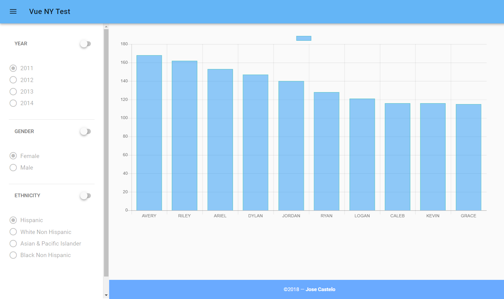

# Analysis of newborn's names in New York

A web application that presents statistics about the names of newborn babies in New York city. It allows to filter by defferent criterias like year, gender and ethnicity.

This sample project was built with Vue and Typescript.

## Screenshots

## Demo

[Live Demo](https://jccb15.gitlab.io/vue-nyc-test)
